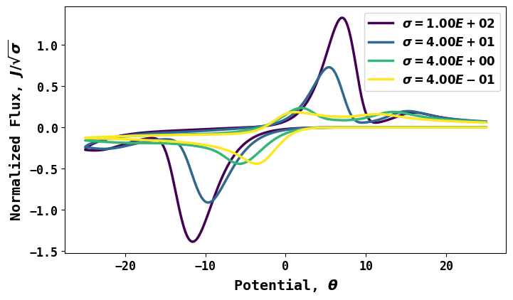
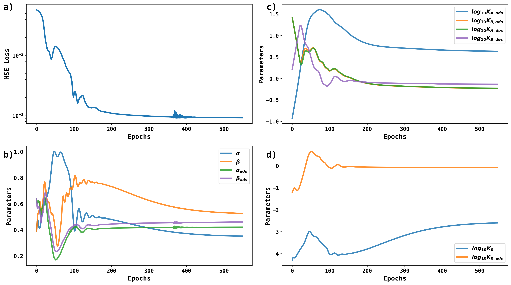
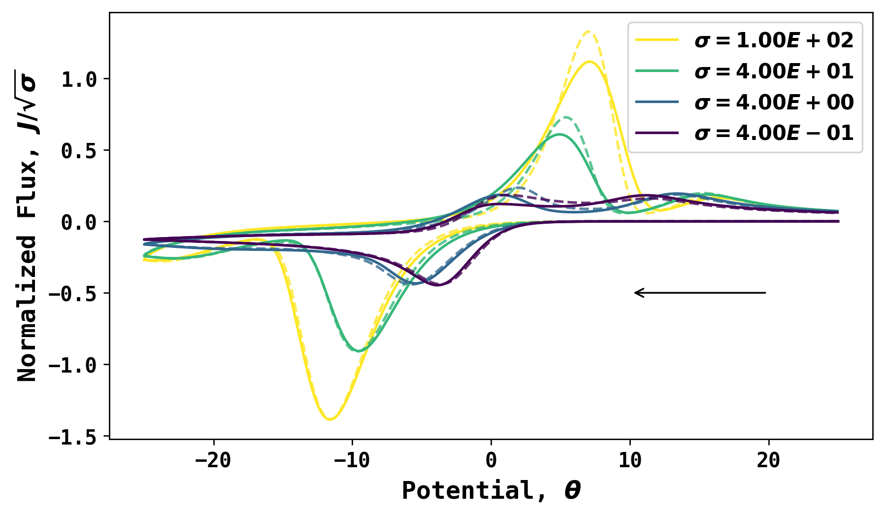

# Differentiable Electrochemistry for electrochemical adsorption/desorption

This repository features DiffEC for voltammetry of adsorbed/desorbed species.

## Problem Setup 
The figure belows shows four ground truth voltammograms at four scan rates. The fluxes are normalized with the square root of dimensionless scan rates so that all voltammograms are in similar numerical scale. The target of Differentiable Electrochemistry simulations are to discover the **10** parameters that best describe all four voltammograms. The four parameters are:

* Solution phase electrochemical rate constant in logarithmic scale, $\log_{10}{K_0}$ 
* Solution phase cathodic reaction transfer coefficient, $\alpha$
* Solution phase anodic reaction transfer coefficient, $\beta$
* Adsorbed species electrochemical rate constant in logarithmic scale, $\log_{10}{K_{0,ads}}$
* Adsorbed species cathodic transfer coefficient, $\alpha_{ads}$
* Adsorbed species anodic transfer coefficient, $\beta_{ads}$
* Adsorption rate constant of $A$ in logarithmic scale, $\log_{10}{K_{A,ads}}$
* Desorption rate constant of $A$ in logarithmic scale, $\log_{10}{K_{A,des}}$
* Adsorption rate constant of $B$ in logarithmic scale, $\log_{10}{K_{B,ads}}$
* Desorption rate constant of $B$ in logarithmic scale, $\log_{10}{K_{B,des}}$



This problem is thus setup to achieve gradient-based discovery of **10** parameters using Differentiable Electrochemistry. 


## DiffEC Optimization. 
A sample trajectory with random initial guess is shown below. (a) The loss; (b) the transfer coefficients; (c) the adsorption/desorption constants; (d) electrochemical rate constants.  The source file is stored in the **history_folder/DiffECDict_1.json**. 



## DiffEC Results 
Using the parameters discovered via Differentiable Electrochemistry simualtions， the simulated voltammograms are compared with ground truth voltammograms. Roughly speaking, the forward scans are well captured. 



## Files 

* **coeff.py**, **grid.py** and **helper.py** are important scripts that support the main simulation programs. The coefficient of matrix and simulation grids are processed there 
* **simulation.py** The entry point of a Differentiable Electrochemistry simulation 
* **simulationHyperParameters.py** Simulation hyperparameters like space step size, number of Newton-Raphson iterations, are stored there. 
* **genGroundTruth.py** Generates the ground truth for DiffEC optimization 
* **DiffECMaster.py** and **DiffECWorker.py** are the "manager" and worker of DiffEC optimization. The manager stores and process the states, and the worker performs simulation and calculates the gradients. 
* **submit_cpu_masters.sh** and **submit_cpu_worker.sh** are the Slurm scripts that initializes the master and worker threads. 

## Run 
To initiate the entire workflow, after propery modification of the **submit_cpu_masters.sh** and **submit_cpu_worker.sh**,  run:

```sbatch submit_cpu_masters.sh```