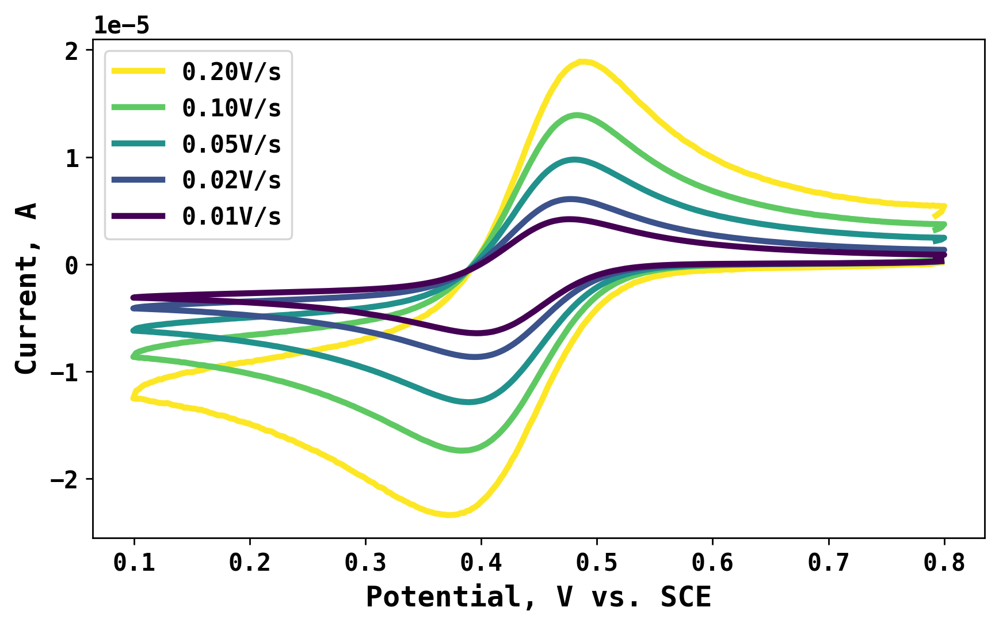
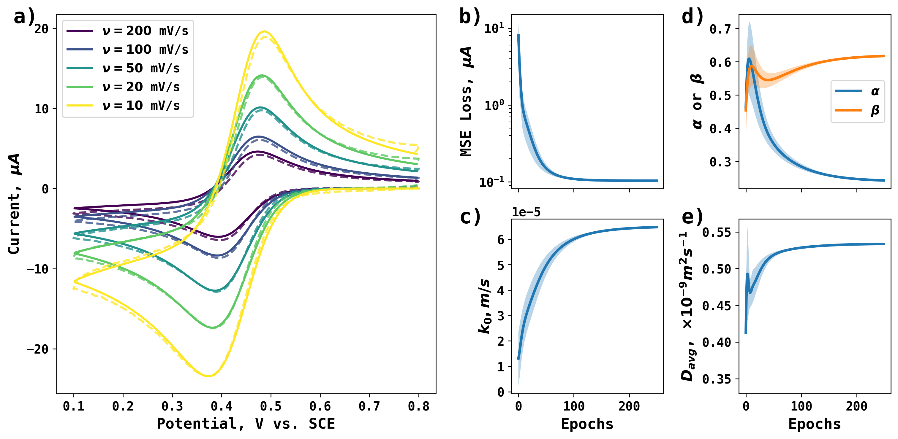

# Differentiable Electrochemistry for Fe<sup>3+</sup>/Fe<sup>2+</sup> Redox Couple


The voltammmetry of Fe<sup>3+</sup>/Fe<sup>2+</sup> redox couple on Pt electrode was reported by *Angew. Chem. 63, 13, e202315937*. The original voltammograms at different scan rates are stored in the 5 mM Fe(3) 1 M H2SO4 on PtE.xlsx file.

The voltammograms are:



In this case, we apply Differentiable Electrochemistry simulation to extract electrochemical rate constant (k<sub>0</sub>), cathodic and anodic transfer coefficients ($\alpha$ and $\beta$), and average diffusion coefficient (D<sub>avg</sub>), via grdient-based optimization. The Differentiable Electrochemistry simulator accounts for both Butler-Volmer kinetics and diffusion transport. 

* By extracting transfer coefficients, Differentiable Electrochemistry provides an viable alternative to traditional Tafel analysis replying on linearized plots. 
* By directly extracting the electrochemical rate constant from a set of quasi-reversible voltammograms, Differentiable Electrochemistry avoids the notorious mapping from $\Delta E_p$ to $\Psi$, offering a better and a long overdue alternative to Nicholson method. 


Run the ConvertToDimensionless.py file converts dimensional voltammograms to dimensionless form, making it easier for simulation. 


To start a high-throughput differentiable simulator (i.e. 30 optimizers running in parallel for ensemble prediction), run the following code (after proper installation of environment and setting partition names):
```sbtach submit_cpu_masters.sh```

The optimization process will be initiated with settings stored in the SimulationHyperParameters.py file.  The process of optimization will be stored in the history_folder. In the history_folder, one trajectory is shown for the reader's reference. 

After sucessfully running all simulation tasks, the ensemble results are shown below as reported in the paper. In general, very good agreemment is obtained between simulation and experiment with optimized parameters. 




