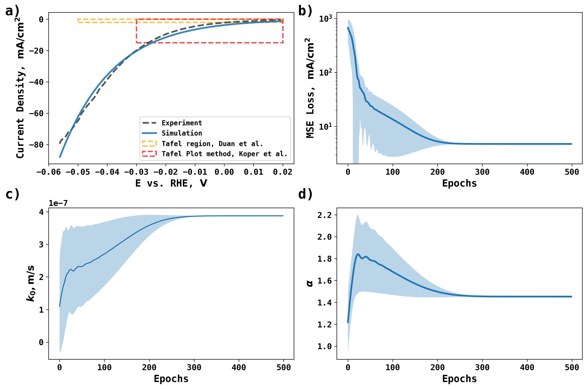

# Differentiable Electrochemistry Simulation of Linear Sweep Voltammetry on Rotating Disk Electrode 

This repository features an important application of Differentiable Electrochemistry simulation. In this case, we are differentiating the linear sweep voltammogram (LSV) of Hydrogen Evolution Reaction (HER) on Pt rotating disk electrode. The LSV data is reported by Koper et al. (*ACS Energy Lett. 2020, 5, 3, 701–709*). The LSV in its dimensionless and dimensional form is shown below.


Using the full LSV data, we build a Differentiable Electrochemistry simulator that finds the best electrochemical rate constant and cathodic transfer coefficient to describe the data via gradient-based optimization. In this process, DiffEC fully accounts for convection mass transport on a rotating disk electrode so that no Tafel region is necessary. 

To replicate the optimization process reported in the paper using ensemble method for uncertainty quantification, the users are expected to use a computing cluster.

To start, submit the master job to Slurm workload manager
 
```sbatch submit_cpu_masters.sh```

which will run the

```DiffHydrodynamicMaster.py``` 

which will create necessary folders, obtain initial guesses, and optimization by submitting the following job repeatedly

```sbatch submit_cpu_worker.sh```

which will run 

```DiffHydrodynamicWorker.py```

During which, the simulated LSV will be compared with the experimental LSV to get a loss value. The loss is differentiable with respect to simulation parameters, and thus allows gradient based optimization. If epochs == 100, DiffHydrodynamicWorker.py will run 100 times. 


In your slurm script, please use the correct partition name. Then everything should be ready to run after proper installation of JAX.


The final result, from ensemble prediction of 30 guesses, are shown in the paper and below.




