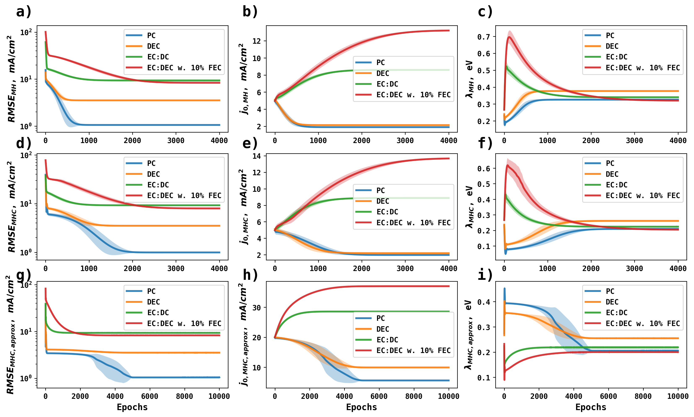

# Mechanistic Identification of Li Metal Anode Electrodeposition/Stripping


Electrodeposition of metal anode, the mechanim is shown below

Li + e<sup>-</sup> <=> Li

Using the transient voltammetry data reported by Boyel et al. (Figure 4a, *ACS Energy Lett. 2020, 5, 3, 701–709*) shown below:


The Marcus-Hush (MH), Marcus-Hush-Chidsey (MHC), and approximate Marcus-Hush-Chidsey (MHC<sub>approx</sub>) are made fully differentiable, so that exchange current density (j<sub>0</sub>, mA/cm<sup>2</sup>) and reorganization energy ($\lambda$, eV) can be obtained from gradient-based optimization of Tafel data.


The ensemble optimization trajectories are shown below:




## Directory Structure

- **KineticModels.py** JAX implementation of differentiable kinetics models, including Butler-Volmer, Marcus-Hush, Marcus-Hush-Chidsey, and the approximate Marcus-Hush-Chidsey. These kinetic models are fully differentiable. 
- **Boyle Figure 4a.csv** The transient voltammetry data reported by Boyel et al. (Figure 4a, *ACS Energy Lett. 2020, 5, 3, 701–709*) extracted using WebplotDigitizer 
- **DiffECHyperParameters.py** Stores hyperparameters for Differentiable Electrochemistry optimization, including the initial guess, learning rate, optimizer 
- **DiffEC.py** Performs the Differentiable Electrochemistry optimization for the experimental data. 
- **AnalyzeResults.py** Plots the optimization trajectories and ensemble predictions for all training trajectories. 

## Usage 
In this current directory, simply run:
```bash
python DiffEC.py
```


## Results 

Results are stored in the history_folder_electrolyte. In each folder, there is one trajectory for three different kintic models. 


