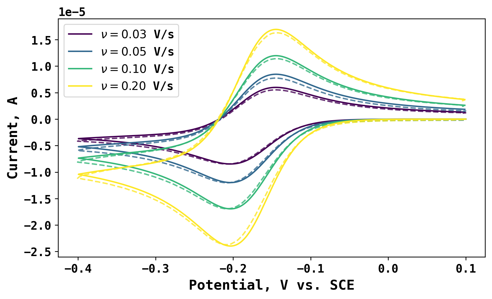
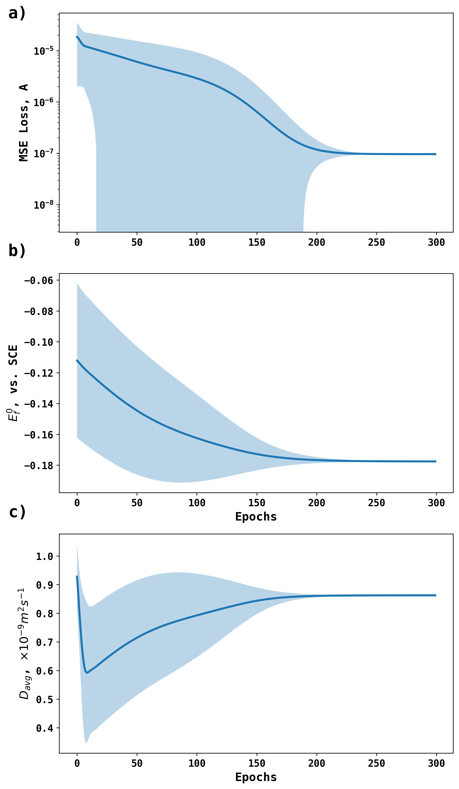

# Differentiable Electrochemistry Simulation for RuHex Voltammetry 

The electrochemical reduction of RuHex couple is:

$$\mathrm{Ru(NH_3)_6^{3-} + e^-<=>Ru(NH_3)_6^{2-}}$$

The electrochemical prcoess is usually very fast (fully reversible), and thus Nernst boundary condition and diffusion equation is suitable to describe its behavior. 

Using experimental data from *Angew. Chem, 63, 13, e20231593*, the experimental voltammograms at different scan rates are collected in *0.96 mM RuHex on GCE.xlsx* and shown below as dashed line. 

The target of Differentiable Electrochemistry simulation is to apply gradient-based optimization and obtain the formal potential and average diffusion coefficient of the RuHex couple. The ensembe predictions are shown below as:

The best fit to the experimental votammogram is shown in the first figure as solid line. 
Please refer to the DiffEC for Fe Redox Voltammetry folder on instructions how to run the experiment.

