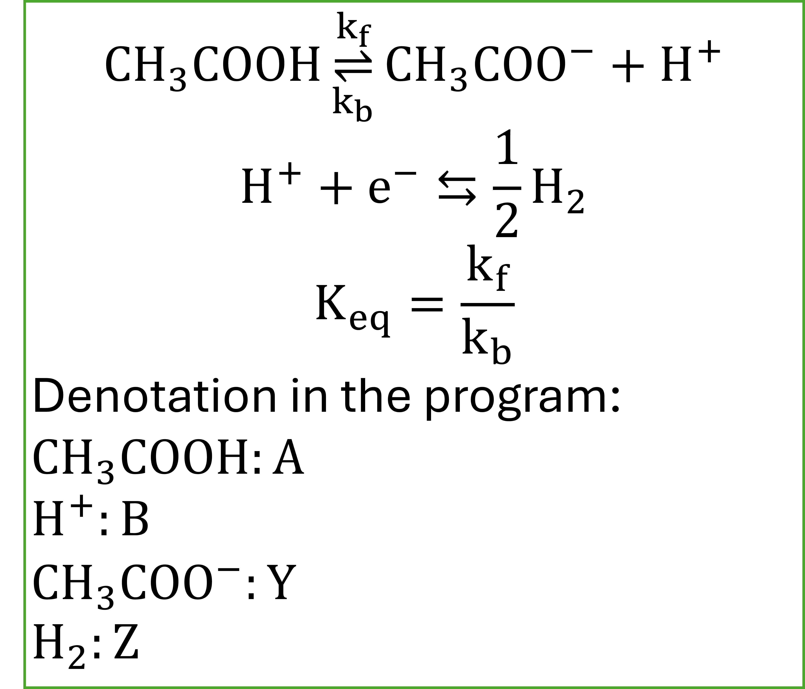

# Differentiable Chemical-Electrochemical Chronoamperometry 

A differentiable simulator of chronoamperometry for dissociative EC mechanism. 

A <-> B + Y (Chemical Reaction)

B + e- <-> Z

The current is differentiable with any input parameters. 

In this example, a complete set of parameters are provided to simulated hydrogen evolution reaction in acetic acid solution. The mechanism is shown below:

In this case, chronoamperometric currents are end-to-end differentiable with respect to  kf, kb or Keq. 