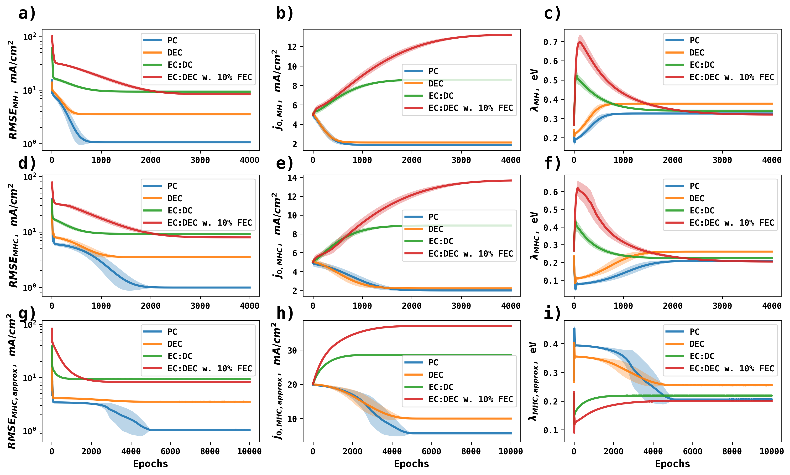

# Mechanistic Identification of Li Metal Anode Electrodeposition/Stripping

Electrodeposition of metal anode, the mechanim is shown below

Li + e- <=> Li

Using the transient voltammetry data reported by Boyel et al. (Figure 4a, *ACS Energy Lett. 2020, 5, 3, 701–709*) shown below:

The Marcus-Hush (MH), Marcus-Hush-Chidsey (MHC), and approximate Marcus-Hush-Chidsey (MHCapprox) are made fully differentiable, so that exchange current density (j0, mA/cm2) and reorganization energy ($\lambda$, eV) can be obtained from gradient-based optimization of Tafel data.

The ensemble optimization trajectories are shown below:

