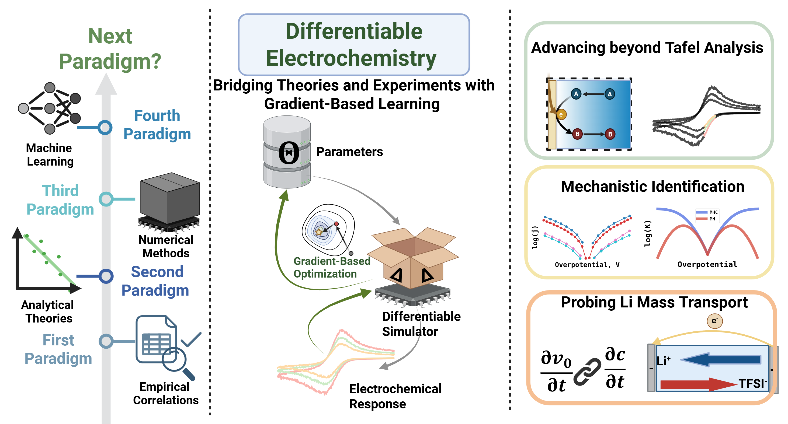

# DiffFarad
This is a code repository in company with "Differentiable Electrochemistry: A paradigm for uncovering hidden physical phenomena in electrochemical systems" currently under consideration. 

This repository features differentiable simulation of voltammetry covering diffusion, migration and convection, along with both Butler-Volmer and Marcus-Hush-Chidsey kinetics. In short, electrochemical simulations are made end-to-end differentiable for parameter estimation and optimization. 

The electrochemical simulations used Finite Difference (FD) methods, and made differentiable using JAX. 

# Requirements 
The programs are run with Python 3.11 and JAX 0.4.34.  The memory requriements for parameter estimations of nonlinear problems are very high. For nonlinear problems, it was run with 480 GB of memory on 6 CPU cores. For linear problem, a normal laptop with 16 GB of memory will suffice. 

# Contents 
* Voltammetry in weakly supported media BV kinetics: Estimating electrochemical kinetics from Butler-Volmer or Marcus-Hush-Chidsey formalism with migration-diffusion mass transport described with Nernst-Planck-Poisson equations
* Voltammetry in weakly supported media MHC kinetics: Estimating electrochemical kinetics from Marcus-Hush-Chidsey formalism with migration-diffusion mass transport described with Nernst-Planck-Poisson equations
* Chronoamperometry of acetic acid reduction: Estimating nonlinear chemical kinetics with convergent diffusion mass transport 
* Hydrodynamic voltammetry: Estimating kinematic viscosity with convection-diffusion mass transport. This example is available at https://colab.research.google.com/drive/1Pq3szUPe8uvd9pw-ZVAZSCmX8nQH2CSM?usp=sharing
* Mass transport in concentrated electrolytes: Estimating salt diffusivity and transference number from operando fields based on concentrated solution theory

# Issue Reports
