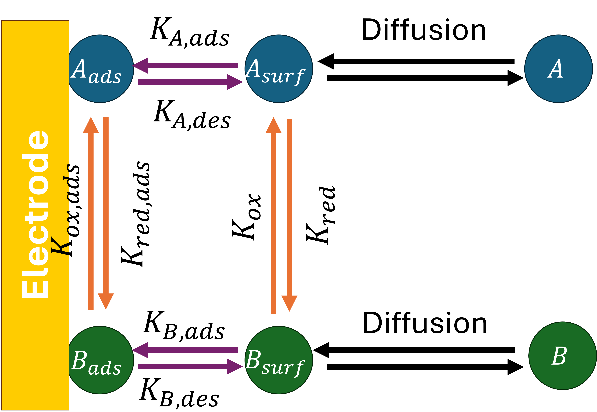

# DiffEC
This is a code repository in company with "Differentiable Electrochemistry: A paradigm for uncovering hidden physical phenomena in electrochemical systems" submitted to *ACS Energy Letters*. 

This repository features differentiable simulation of voltammetry covering diffusion, migration and convection, along with both Butler-Volmer and Marcus-Hush-Chidsey kinetics. These partial differential equations (PDEs) are solved with Finite Difference method (implicit Euler scheme).  In short, electrochemical simulations are made end-to-end differentiable for parameter estimation and optimization. 

The purposes of this repository are twofold:

*  Introducing the art of differentiable simulations to electrochemists with abundant transferable simulators and case studies (tutorials)
*  Applying Differentiable Electrochemistry simulations to solve bottleneck problems in Electrochemistry

The electrochemical simulations used Finite Difference (FD) or Finite Element (FE) methods, and made differentiable using JAX. 

# Requirements 
The programs are run with Python 3.11 and JAX 0.4.34.  The memory requirements for parameter estimations of nonlinear problems are very high. For nonlinear problems, it was run with 480 GB of memory on 6 CPU cores. For linear problem, a normal laptop with 16 GB of memory will suffice. 

# Differentiable Simulators
Since Differentiable Simulation is a new regime in scientific modeling, it is thus very important for beginners to learn the art of differentiable simulation and differentiable simulation in the context of electrochemistry. In here, five simulators that are fully differentiable and transferable are provided to enlighten readers the art of differentiable simulation. They five differentiable simulators are:

1. Fundamental Cyclic Voltammetry Simulator. Models the simplest one-electron redox reaction. 
2. Voltammetry in Weakly Supported Media. Extends fundamental CV with electrolyte migration effects by solving Nernst-Planck-Poisson equation. BV and MHC kinetics are supported. 
3. Dissociative EC Simulator. Models coupled chemical-electrochemical mechanisms, where a species dissociates chemically before electron transfer. A <-> B+C , B+e- <-> D. 
4. Hydrodynamic Voltammetry Simulator. Models rotating-disk electrode (RDE) experiments under convection-diffusion mass transport. 
5. Electrochemical Adsorption/Desorption Simulator. Simulates surface-confined redox reactions and Langmuir isotherm adsorption/desorption processes. The mechanism is shown below:

Overall, these simulators cover a broad range of electrochemical phenomena (diffusion, migration, convection, and coupled reactions), and are differentiable with respect to key physicochemical parameters, enabling **gradient-based fitting, sensitivity analysis, and machine learning integration**.
 

# Proof-of-Concept Case Studies 
* Voltammetry in weakly supported media BV kinetics: Estimating electrochemical kinetics from Butler-Volmer or Marcus-Hush-Chidsey formalism with migration-diffusion mass transport described with Nernst-Planck-Poisson equations
* Voltammetry in weakly supported media MHC kinetics: Estimating electrochemical kinetics from Marcus-Hush-Chidsey formalism with migration-diffusion mass transport described with Nernst-Planck-Poisson equations
* Chronoamperometry of acetic acid reduction: Estimating nonlinear chemical kinetics with convergent diffusion mass transport 
* Differentiable Electrochemistry for voltammetry of adsorbed species. A total of 10 parameters are discovered simultaneously with gradient-based optimization! 
* Hydrodynamic voltammetry: Estimating kinematic viscosity with convection-diffusion mass transport. This example is available at https://colab.research.google.com/drive/1Pq3szUPe8uvd9pw-ZVAZSCmX8nQH2CSM?usp=sharing

# Experimental Application 

* Differentiable Electrochemistry for Fe3+/Fe2+ redox couple: Electrochemical rate constant, average diffusion coefficient, cathodic and anodic electrochemical rate constants are simultaneously discovered from multiple voltammograms at different scan rates. This is a major advancement from conventional Tafel analysis and Nicholson method. 
* Differentiable Electrochemistry for RuHex redox couple: Since the RuHex couple is usually considered fully reversible, the formal potential and average diffusion coefficients are discovered. 
* Transfer coefficient from LSV on Rotating Disk Electrode: Using differentiable electrochemistry to build a direct correlation between linear sweep voltammogram of Hydrogen Evolution Reaction with its transfer coefficient and electrochemical rate constant. In this example, Differentiable Electrochemistry analyzed the HER LSV data reported by Koper et al.(ACS Energy Lett. 2024, 9, 4, 1871–1879) by fully accounting for convection-diffusion mass transport and kinetics. A "Tafel Region" is unnecessary. 
* Mechanistic Identification of Li electrodeposition/stripping. Using transient voltammetry data reported by Boyel et al. (ACS Energy Lett. 2020, 5, 3, 701–709), Differentiable Electrochemistry is applied to fit transient data with Marcus-Hush (MH),Marcus-Hush-Chidsey (MHC), and the approximate Marcus-Hush-Chidsey (JEAC, 735, 77, 2014). Notably, we enabled direct parameterization of MHC without replying approximation. 
* Mass transport in concentrated electrolytes: Estimating salt diffusivity and transference number from Operando concentration and velocities fields from XAM and XPCS with concentrated solution theory.

# Issue Reports
We recommend issue reports in the Discussions channel. 
